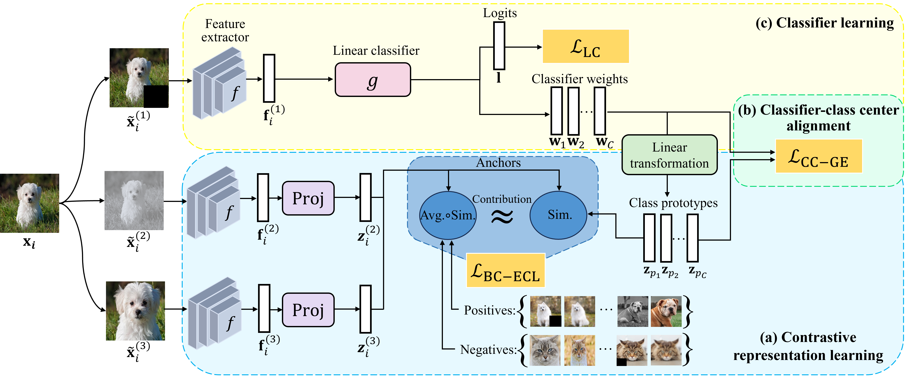

# ECL: Equilibrium contrastive learning for imbalanced image classification_TETCI


This is a Pytorch implementation of the [ECL paper]():

<p align="center">

</p>


## Requirement
- pytorch>=2.1.0
- torchvision
- tensorboardX

### CIFAR-10-LT


| Method | IF | Top-1 Acc(%) |
| :---:| :---:|:---:|
| ECL   | 100   | 92.1%    |
| ECL   | 50    | 92.5%    |
| ECL   | 10    | 94.4%    |


### CIFAR-100-LT

```

| Method | IF | Top-1 Acc(%) |
| :---:| :---:|:---:|
| ECL   | 100   | 66.3%    |
| ECL   | 50    | 67.5%    |
| ECL   | 10    | 71.0%    |


### ImageNet-LT 
To do supervised training with ProConDual for 180 epochs on ImageNet-LT, run
```
python main_imagenet.py
```
(All default parameter setups are included in main_imagenet.py)


| Method | Model | Many | Med | Few | All | model |
| :---:| :---:|:---:|:---:|:---:| :---:|  :---:| 
| ECL |ResNeXt-50 | 68.6  | 56.3  | 40.1     | 58.8    | [Download]() |


### ISIC2019 


| Method | Model | Top-1 Acc(%) | link | 
| :---: | :---: | :---: | :---: | 
|ECL | ResNet-50   | 87.31 | [Download]() | 


    

